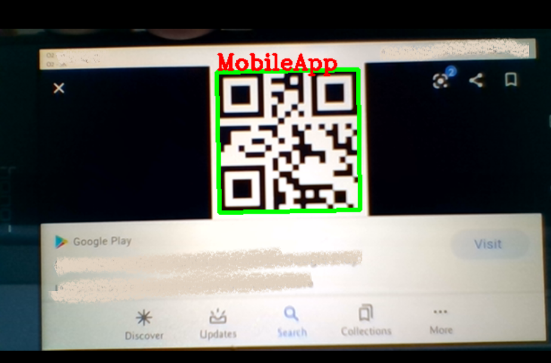

# QR code generator & reader

Light code to generate QR code as well as read.

<b> READING</b>

```
rd = Read()
rd.read_QR_code(path)
```

In order read the QR code your webcam will start up.
When you show the QR code, it will be registered in the "register.txt" file in format "time***QR-data " i.e.:

``` Tue Jun  9 07:28:24 2020***MobileApp```

Webcam output:
</img>
To QUIT use "q"

<b> GENERATING </b>

To generate QR-code use:
```
rd = Read()
rd.getFromImage('Test qr code', True)
```
```True``` if you want to open the generated QR code.

The QR code will be saved as "QRcode...jpg"


